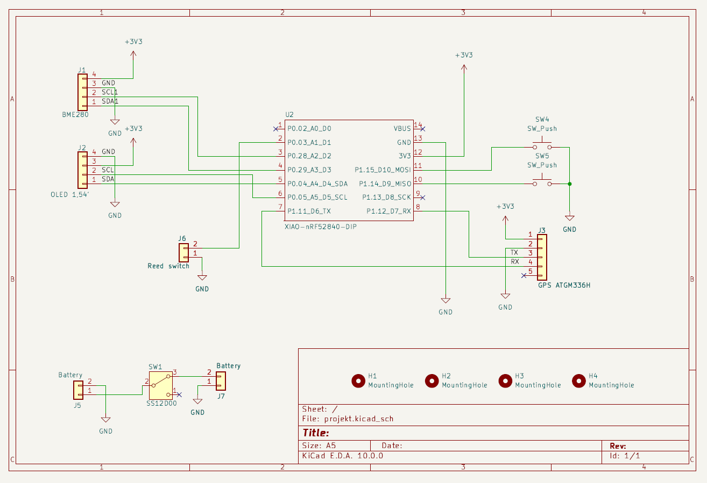
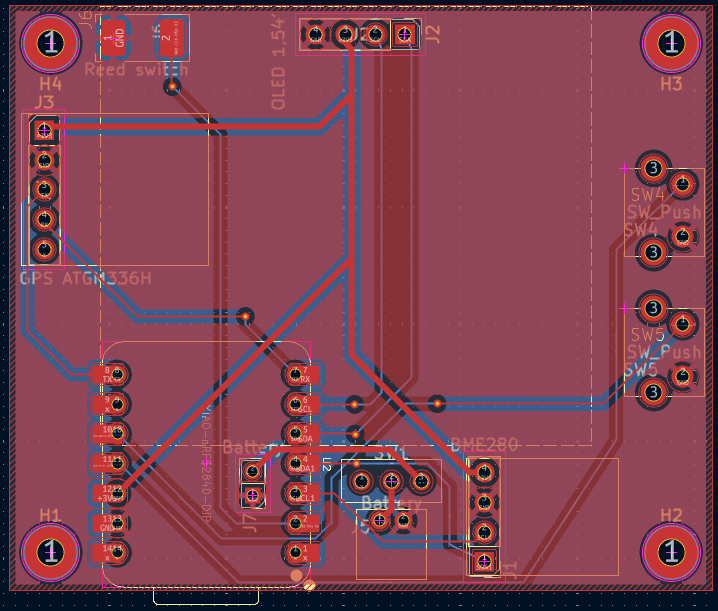
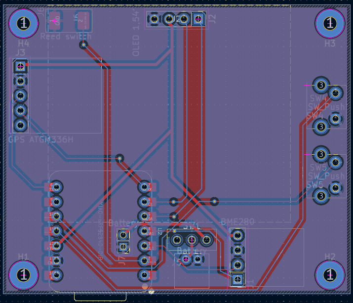

# Custom IoT Bike Computer

A work-in-progress, low-power custom bicycle computer featuring speed measurment, GPS tracking, environmental sensing, and an OLED display. The hardware is designed from scratch with a custom PCB created in KiCad.

## Description

This project aims to build a standalone, power-efficient bike computer. At its core is the Seeed Studio **XIAO nRF52840**, a very energy efficient microcontroller with native Bluetooth Low Energy support.

The device combines data from a classic magnetic reed switch (for speed tracking) with an external GPS module for route tracking and distance calculation. Additionally, it integrates a BME280 sensor to monitor environmental conditions (temperature, humidity, and barometric pressure).

## Hardware Components

* **MCU:** Seeed Studio XIAO nRF52840
* **GPS Module:** ATGM336H
* **Environment Sensor:** BME280
* **Display:** 1.54" I2C OLED
* **Sensors:** Magnetic Reed Switch (Normally Open)
* **Power:** 470mAh Li-Pol Battery with hardware switch

## Project Status: Work In Progress

## Project Structure

```text
.
├── hardware/
│   ├── bike_computer.kicad_sch  # KiCad Schematic file
│   ├── bike_computer.kicad_pcb  # KiCad PCB layout file
│   └── img/					 # Schematic and PCB layout images
├── software/					 # Firmware files
└── README.md
```

## Visuals

### Schematic


### PCB



## Authors

Krzysztof Bieszczad
[@KBieszczad](https://github.com/KBieszczad)
